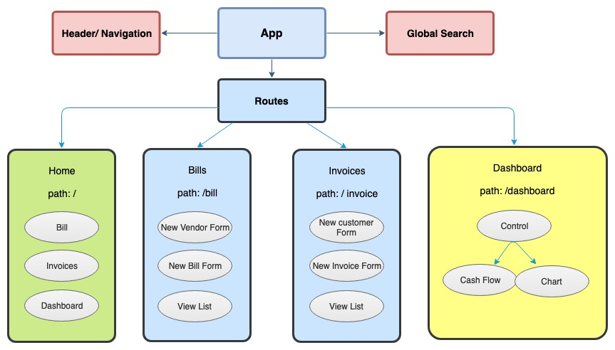
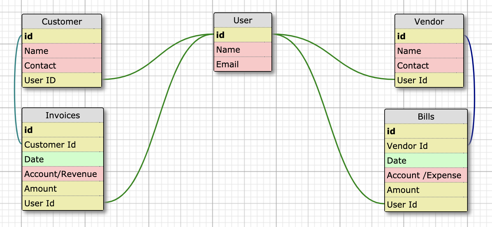

<h3 align="center"> KeepBook </h3>
<h4 align="center"> By Ngan Nguyen </h4>

## Description

_This application allows user to create bills and invoices. It will also have the option to view the cashflow statement ._

## Component Tree

# 

## User Role

# 

## Simple Database for User and Transactions

# 

_DB setup per schema_
* https://github.com/Ngann/KeepBook-DB.git

_FullStack environment setup: Node, React, AWS Aurora_
* https://github.com/Ngann/KeepBook-FS.git

## Static Version of Application
_See below link for static version of site._
* https://github.com/Ngann/KeepBookStatic.git

## Table of content

- [Installation](#installation)
- [Features](#Features)
- [Technology](#technology)
- [License](#license)


## Step 1: Break The UI Into A Component Hierarchy
1. Filterable List of Invoices or bills
2. SearchBar to filter through Invoices or Bills by customer/vendors etc..
3. Invoices List Table
4. Bills List Table
5. Invoice form
6. Bills form
7. Dashboard Control

## Component Tree


## Installation

1. Go to terminal and clone this repository:
```
$ git clone git repository link
```
2. Change into the project directory and install npm
```
$ npm install
```
3. To run the program:
```
$ npm start
```
4. Open project  at http://localhost:8080/

## Features

## Planned Features
* User can add Vendors and Customers
* User can add Bills and Invoices
* User can mark transactions as paid
* User can go to dashboard to see Income and Expense by category, outstanding Bills/Invoices and Bank Account Balances


## Technology
* Javascript
* React
* Materialize / Material UI
* NodeJs
* GraphQL
* Prisma
* AWS Aurora
* Bcrypt
* JWT

## Research for Stack to use
_React, Okta, Sqlite3_
* https://github.com/Ngann/React-Sqlite3.git

_Node, GraphQL , Prism, AWS Aurora_
* https://github.com/Ngann/hackernews-node.git

## License
* This project is licensed under the MIT License - see the LICENSE.md file for details
